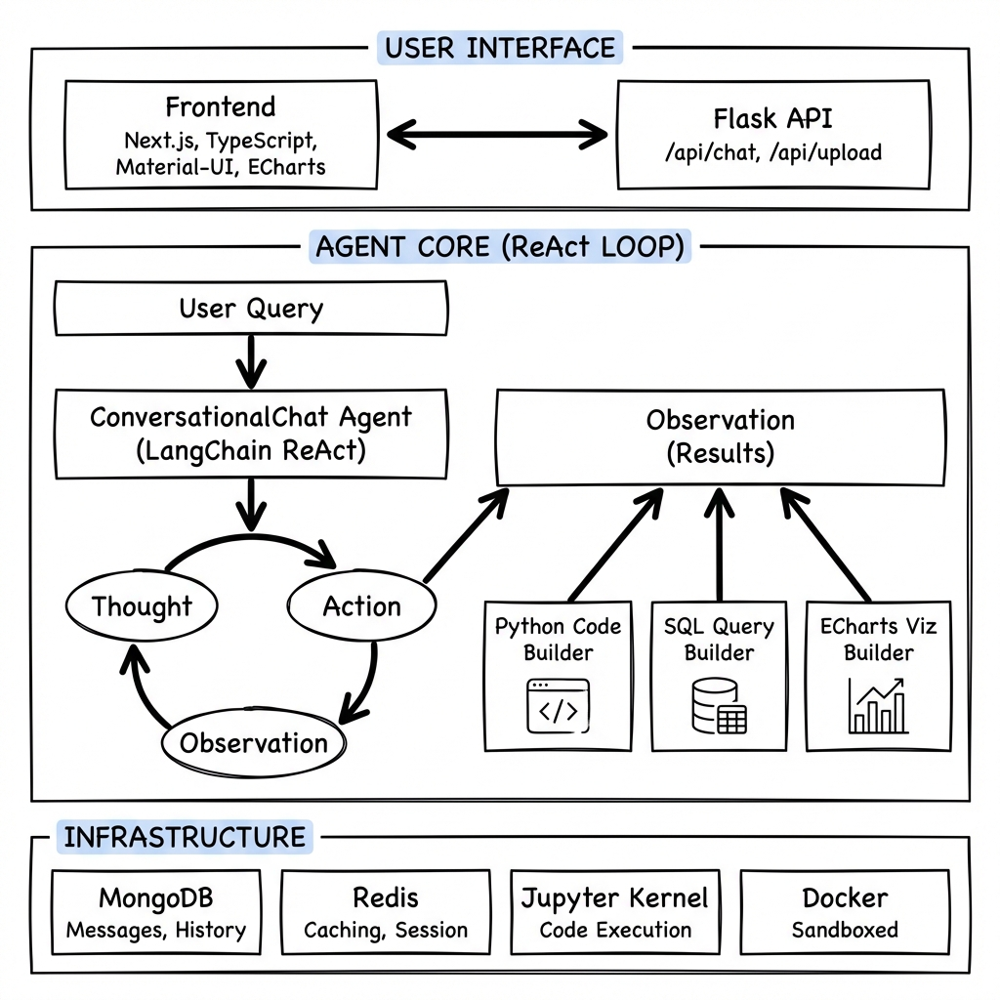

<div align="center">

# Data Agent

### Conversational Data Analysis with LangChain ReAct Agents

An AI assistant that converts natural language data questions into executable Python and SQL using LangChain ReAct agents — with autonomous tool selection, sandboxed code execution, persistent memory, and real-time streaming of reasoning steps.

[](https://opensource.org/licenses/MIT)
[](https://www.python.org/downloads/)
[](https://nodejs.org/)
[](https://github.com/langchain-ai/langchain)

</div>

---

## Motivation

Most data analysis tools are either rigid BI dashboards that can't handle ad-hoc questions, or notebook environments that require coding expertise. Neither works for business users who have data questions but can't write SQL or Python.

Data Agent bridges this gap by turning an LLM into an analyst that can:
- Understand a vague business question ("What's our best-performing product category this quarter?")
- Decide which tool to use (SQL query? Python analysis? Visualization?)
- Execute code in a sandboxed environment and iterate if the first attempt fails
- Stream its reasoning process in real-time so users can follow along

---

## Architecture

<div align="center">

</div>

### ReAct Agent Loop

<div align="center">

</div>

> The agent decomposed a vague business question into 3 steps — SQL extraction, Python analysis, and visualization — without any hardcoded workflow. It decided *which* tools to use, *in what order*, and *chained* them together.

---

## Features

| Feature | Description |
|---------|-------------|
| **ReAct Agent Loop** | Thought, Action, Observation cycle using LangChain agents |
| **Dynamic Tool Selection** | Agent chooses between Python, SQL, visualization, and data loading tools |
| **Sandboxed Execution** | Python/SQL runs in isolated Jupyter kernels (local or Docker) |
| **Auto-Visualization** | Generates interactive ECharts visualizations from natural language |
| **Conversational Memory** | Persistent context across multi-turn conversations via MongoDB |
| **Real-time Streaming** | Streams agent reasoning steps and code execution results live |
| **Multi-format Input** | CSV, Excel, databases, and Kaggle dataset integration |
| **Secure Execution** | Docker-based sandboxing for untrusted code |

---

## Tech Stack

### Agent and AI Layer
| Component | Technology | Purpose |
|-----------|-----------|---------|
| Agent Framework | LangChain | ReAct agent orchestration, tool management, prompt chaining |
| LLM Support | GPT-4, GPT-3.5, Claude, Azure OpenAI | Multi-model support with configurable endpoints |
| Code Execution | Jupyter/IPython Kernels | Sandboxed, stateful Python execution with variable persistence |

### Backend
| Component | Technology | Purpose |
|-----------|-----------|---------|
| Web Framework | Flask | REST API server with streaming support |
| Database | MongoDB | Conversations, messages, and user storage |
| Caching | Redis | Session state, kernel management |
| Concurrency | Multiprocess + Threading | Concurrent kernel execution and background tasks |

### Frontend
| Component | Technology | Purpose |
|-----------|-----------|---------|
| Framework | Next.js + TypeScript | Server-side rendering, type safety |
| UI Library | Material-UI | Component library |
| Visualization | ECharts | Interactive data visualizations |
| Code Editor | CodeMirror | Syntax-highlighted code display |
| Styling | Tailwind CSS | Responsive styling |

---

## Agent Tools

Each tool is selected by the agent based on the user's intent:

### PythonCodeBuilder
Generates and executes Python code in a Jupyter kernel. Supports pandas, numpy, scikit-learn, matplotlib — full data science stack.

**Triggers:** "Analyze this data", "Calculate the average", "Clean the dataset"

### SQLQueryBuilder
Generates SQL, validates syntax, and executes against connected databases. Supports complex JOINs, aggregations, window functions, subqueries.

**Triggers:** "Query the database", "Find all records where...", "Join these tables"

### ECharts Visualization
Analyzes data shape, selects chart type, and generates interactive ECharts configs.

**Triggers:** "Show me a chart", "Visualize this", "Plot the trend"

### KaggleDataLoader
Searches Kaggle API, downloads datasets, and loads them into the session.

**Triggers:** "Find a dataset about...", "Load the Titanic dataset"

---

## Quick Start

```bash
git clone https://github.com/charan2456/DataAgent.git
cd DataAgent

# Backend
cd backend
pip install -r requirements.txt
export OPENAI_API_KEY=your_key_here
python main.py

# Frontend (new terminal)
cd frontend
npm install
export NEXT_PUBLIC_BACKEND_ENDPOINT=http://localhost:8000
npm run dev
```

Visit `http://localhost:3000` to start using Data Agent.

---

## Installation

### Prerequisites

- Python 3.10+
- Node.js 18+
- MongoDB
- Redis
- OpenAI API Key (or compatible LLM API)

### Backend

```bash
conda create -n data-agent python=3.10
conda activate data-agent

cd backend
pip install -r requirements.txt

export OPENAI_API_KEY=your_key_here
export MONGO_SERVER=127.0.0.1
export REDIS_SERVER=127.0.0.1
export CODE_EXECUTION_MODE=local  # or "docker" for sandboxed execution

# Initialize MongoDB
mongosh
> use data_agent
> db.createCollection("user")
> db.createCollection("message")
> db.createCollection("conversation")
> db.createCollection("folder")

python main.py
```

### Frontend

```bash
cd frontend
npm install
export NEXT_PUBLIC_BACKEND_ENDPOINT=http://localhost:8000
npm run dev
```

Open `http://localhost:3000`.

---

## Docker Deployment

```bash
docker-compose build
docker-compose up -d
```

### Code Execution Modes

| Mode | Security | Performance | Use Case |
|------|----------|-------------|----------|
| `local` | Runs on host | Fast | Development, trusted environments |
| `docker` | Isolated containers | Normal | Production — sandboxed execution |

```bash
export CODE_EXECUTION_MODE=docker  # Recommended for production
```

---

## API Reference

| Endpoint | Method | Description |
|----------|--------|-------------|
| `/api/chat` | POST | Main chat — sends query, returns agent response with streaming |
| `/api/conversation` | POST | Retrieve full conversation history by ID |
| `/api/conversations/get_conversation_list` | POST | List all conversations for a user |
| `/api/upload` | POST | Upload CSV, Excel, or database files for analysis |
| `/api/llm_list` | GET | Get available language models |

---

## Project Structure

```
DataAgent/
|-- backend/                     # Flask API Server
|   |-- api/                     # REST API endpoints
|   |-- main.py                  # Entry point + memory pool init
|   |-- app.py                   # Flask app configuration
|   +-- schemas.py               # Request/response schemas
|
|-- real_agents/                  # Agent Intelligence Layer
|   |-- adapters/                # Shared infrastructure
|   |   |-- llm.py              # Custom LLMChain with DataModel support
|   |   |-- agent_helpers/      # Agent base classes + output parsing
|   |   |-- callbacks/          # Streaming + logging callbacks
|   |   |-- data_model/         # Data model abstractions (25 files)
|   |   |-- executors/          # Tool execution engines
|   |   |-- memory/             # Conversation memory management
|   |   +-- models/             # LLM model configurations
|   |
|   +-- data_agent/              # Data Agent implementation
|       |-- copilot.py          # ConversationalChatAgent (ReAct core)
|       |-- copilot_prompt.py   # System prompts + ReAct format instructions
|       |-- executors/          # Tool-specific executors
|       |-- python/             # Python code execution tools
|       |-- sql/                # SQL query execution tools
|       +-- evaluation/         # Response evaluation
|
|-- frontend/                    # Next.js Frontend
|   |-- components/             # React UI components
|   |-- pages/                  # Next.js pages
|   +-- styles/                 # Tailwind CSS configuration
|
|-- docker-compose.yml           # Multi-container Docker deployment
+-- Dockerfile                   # Backend container definition
```

---

## Technical Highlights

### Custom ReAct Implementation
Data Agent extends the base LangChain agent with:
- **Scratchpad optimization** — Constructs AI message history to minimize token usage
- **Token budget management** — Dynamic truncation to stay within model context limits (8K tokens)
- **Continue prompts** — Model-specific continuation strategies for long reasoning chains
- **Tool response templating** — Structured observation format that guides the agent's next step

### Stateful Code Execution
The Jupyter kernel maintains state across turns:
```
Turn 1: "Load this CSV"           -> df variable persists
Turn 2: "Filter rows where x > 5" -> Operates on existing df
Turn 3: "Plot the results"        -> Uses filtered df from Turn 2
```

### Multi-Model Support
Hot-swap between:
- OpenAI (GPT-3.5, GPT-4)
- Anthropic (Claude v1, v2)
- Azure OpenAI
- Any OpenAI-compatible endpoint (local LLMs via Ollama, vLLM, etc.)

### Memory Architecture
```
MongoDB (Persistent)           Redis (Session)
|-- Conversations             |-- Active kernel sessions
|-- Messages                  |-- Cached query results
|-- User profiles             +-- Temporary state
+-- Uploaded file metadata
```

---

## License

MIT License — see [LICENSE](LICENSE) for details.

---

<div align="center">

**Built by [Charan Kotapati](https://github.com/charan2456)**

</div>
